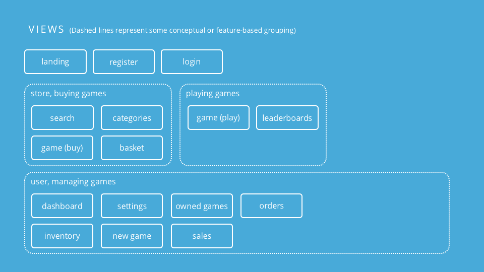
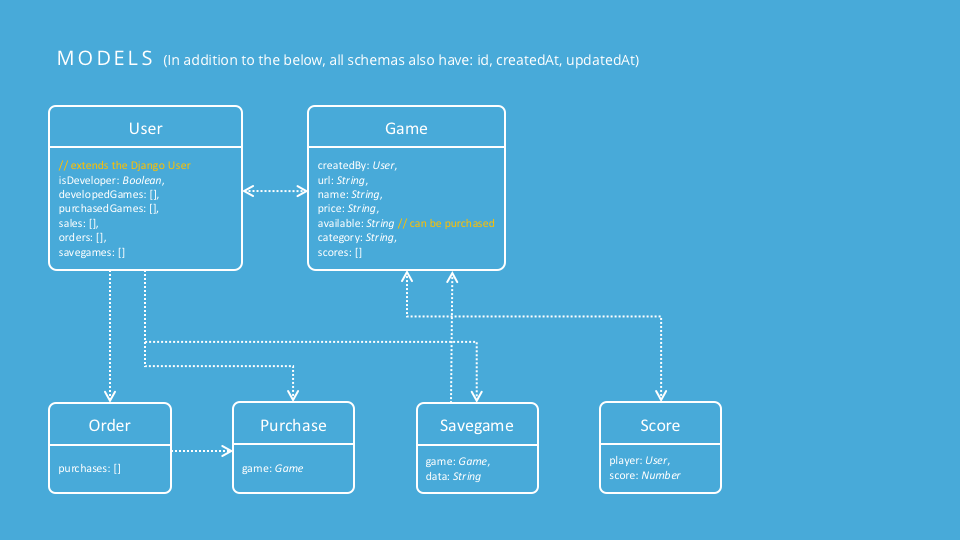

# NOTE: Draft

----
### Views

The site has the following views:

- Landing

  Featured games, suggestions, etc.

- Search

  Search based on game properties, e.g. price, category

- Categories

  A list of game categories

- Game (buy)

  The details page for an individual game in the store

- Basket

  The shopping basket

- Checkout

  The order complete / checkout page

- Login

  User login

- User (dashboard)

  The main page for a user

- User (settings)

  The user's settings for profile, password change, etc.

- User (inventory)

  A list of games added by a developer, for developers

- User (sales) (dev only)

  Sales history and statistics, for developers

- User (purchased games)

  A list of the user's purchased / owned games

- User (orders)

  Order / purchase history

- User (savegames)

  A list of all of the user's saved games

- Game (play)

  Where the game is played

- Leaderboards

  A summary page for all games' high scores

----
### Models

The backend includes the following object models:

- User

  Represents a user of the system. All users are players, but also developers.

- Game

  Represents a game in the system. Added by a developer.

- Score

  Represents a high score result. Is created based on the information sent by the game when played.

- Order

  Represents a purchase of one or more games in a single transaction. A collection of Purchases.

- Purchase

  Represents a purchase of a single game.

- Savegame

  Represents a saved game state. Is created based on the information sent by the game when played. Can contain any data as determined by the game.